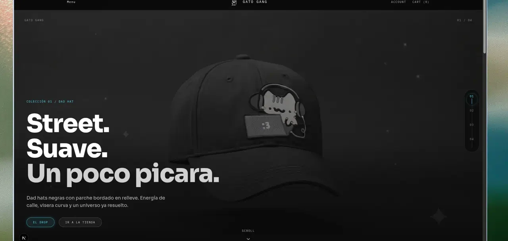
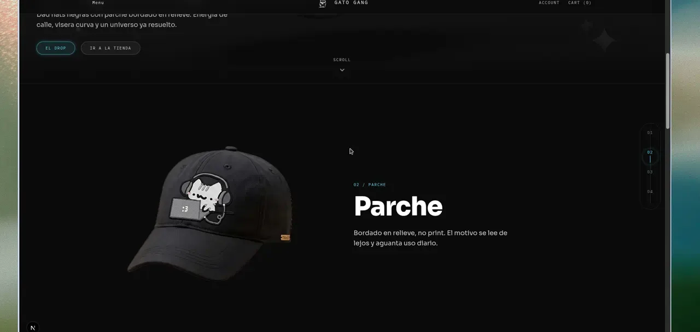
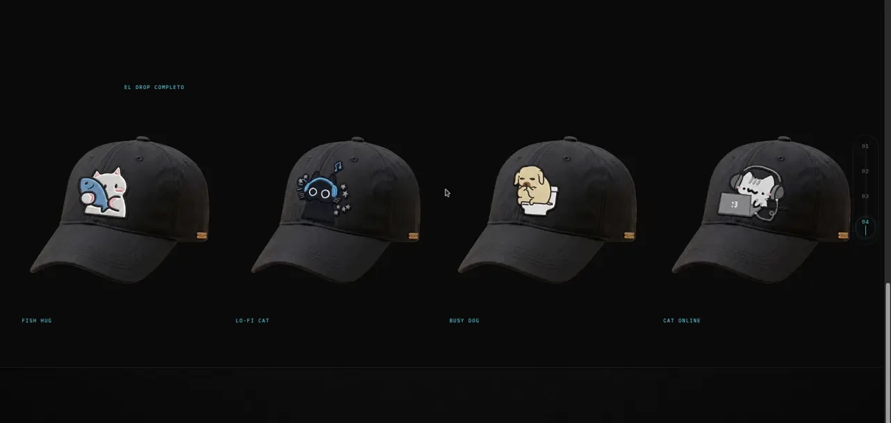
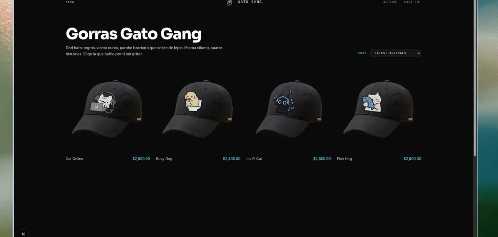
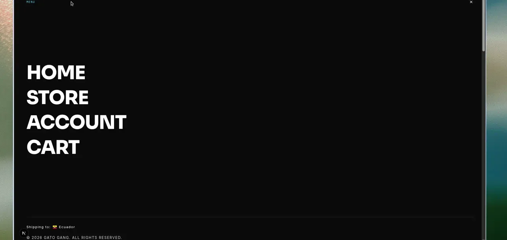

# Gato Gang Store

Gato Gang · Medusa v2 storefront — dad hats, scroll editorial, SEO cableado

Storefront Gato Gang sobre Medusa v2: home editorial (hero + traits + drop), store dark, titles/metas/H1 desde `seo/`, packshots con alts. Práctica del evento: https://github.com/martinruizn/supaday-usfq

**Repo:** [github.com/RonaldoBTC-code/Store](https://github.com/RonaldoBTC-code/Store)  
**Preview local:** `http://localhost:8000/ec`

---

## Project pitch

**Gato Gang** es una marca de dad hats streetwear: silueta curva, corona unstructured y parche bordado en relieve. Este repo es la tienda — **Medusa v2** + storefront Next — pensada como drop, no como catálogo genérico.

Home en `/ec`: hero de estudio → trait caps **Parche / Visor / Material** → **El drop completo**. Marca oscura, menú limpio, packshots true-alpha (sin damero ni placas blancas).

---

## What was built

- **Hero** con video de estudio (`transparente-3-fondo-negro.mp4`) y packshots true-alpha. Sin damero, sin placas blancas.
- **Home:** hero → trait caps **Parche / Visor / Material** → **El drop completo** (Fish Hug, Lo-Fi Cat, Busy Dog, Cat Online).
- **Dark brand** Gato Gang: ink, acento neon, logo visible.
- **Menú limpio:** HOME / STORE / ACCOUNT / CART sobre overlay negro (sin Sort / Size / Color).
- **Store** (`/ec/store`): grilla de packshots sobre ink. Sin filtros Size/Color; solo sort compacto.
- **SEO** cableado desde `seo/` + `store/apps/storefront/src/lib/seo/copy.ts` (titles, metas, H1, alts). El copy de producto no se reescribe aquí.

SKUs del drop: **Fish Hug · Lo-Fi Cat · Busy Dog · Cat Online**.

---

## Screenshots

Capturas del storefront en `http://localhost:8000/ec`.

### Hero / home



### Trait chapter — Parche



### El drop completo



### Store grid



### Clean menu



---

## Practice / event repo

Este Store creció a partir de la práctica de **Supaday USFQ**:

**[github.com/martinruizn/supaday-usfq](https://github.com/martinruizn/supaday-usfq)**

El workshop fue el punto de partida (Medusa, catálogo, storefront). Gato Gang es el proyecto que Ramoide armó después: misma base de práctica, marca y drop propios.

Crédito a los organizadores de Supaday USFQ y al repo de práctica.

---

## Repo

- **Store (este proyecto):** [https://github.com/RonaldoBTC-code/Store](https://github.com/RonaldoBTC-code/Store)
- **Práctica Supaday USFQ:** [https://github.com/martinruizn/supaday-usfq](https://github.com/martinruizn/supaday-usfq)

---

## How to run

Desde `store/` (Node 20+, PostgreSQL 15+, pnpm 10+):

```bash
# backend — http://localhost:9000  (admin: /app)
cd apps/backend
cp .env.template .env   # set DATABASE_URL
pnpm exec medusa db:migrate
pnpm exec medusa develop

# storefront — http://localhost:8000  (home: /ec)
cd apps/storefront
# .env.local: NEXT_PUBLIC_MEDUSA_PUBLISHABLE_KEY
#             NEXT_PUBLIC_MEDUSA_BACKEND_URL=http://localhost:9000
#             NEXT_PUBLIC_DEFAULT_REGION=ec
pnpm dev
```

O desde `store/`: `pnpm dev` levanta ambos.

---

## PRs / timeline

1. **SEO** — titles, metas, H1 y alts desde `seo/` + `copy.ts` (#1)
2. **Chapter scroll** — home editorial (#2)
3. **Assets / brand** — hero de estudio, true-alpha, Gato Gang dark (#3)
4. **Traits + menu** — Parche / Visor / Material, menú HOME/STORE/ACCOUNT/CART, store sin Size/Color (#4)
